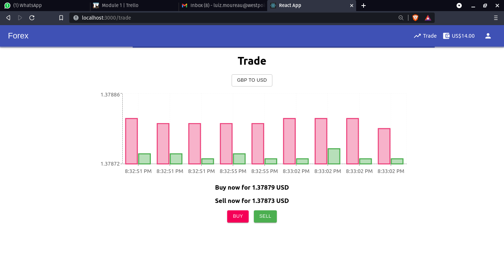
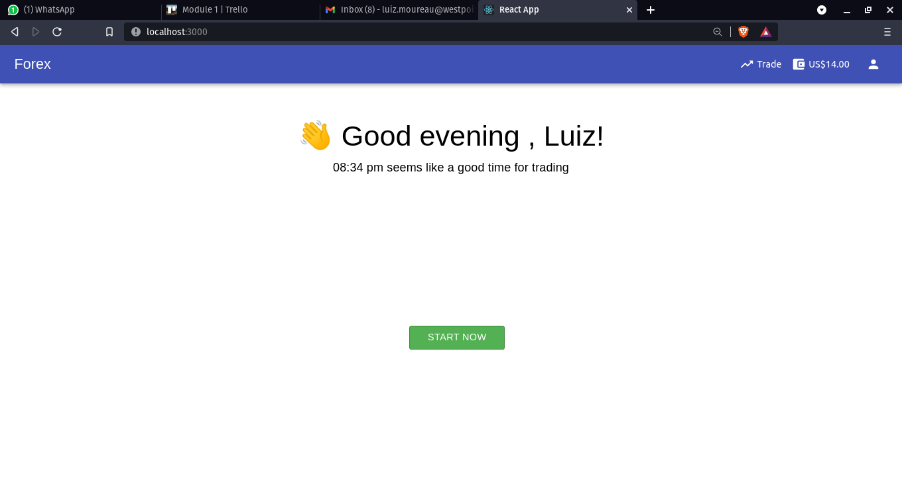
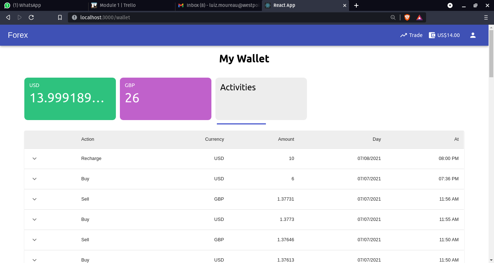
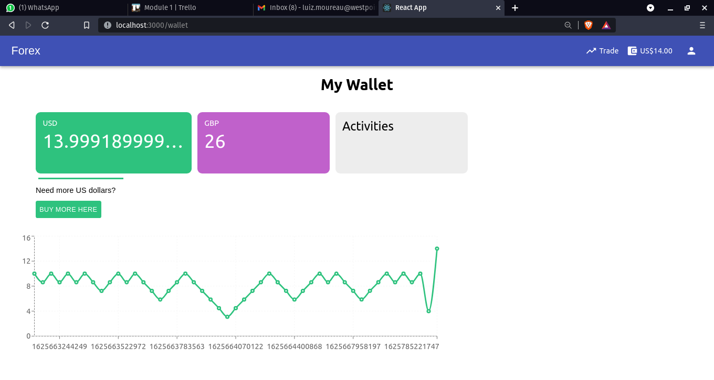

# Forex App

  
More Screenshots

  
  
  
  
  

### What is it

This is a Node/React App (both coded in Typescript), that lets user trade USD for GBP and vice-versa with real-time data, which means they have real time information about these currencies values.

### Why should you use it

It is easy to implement it and has most of functionalities you may need, such as account management, database schemas, websockets settings, and it is scalable, because it is not hardcoded to support only GBP and USD.

### Which technologies it uses

It's made with React, Node, WebSockets, Socket.io, Jest, Express, MongoDB, Mongoose and MaterialUI

### How it works

When a user navigates to `/trade` on the front-end, it triggers a websocket listener on the server, which connects to [TraderMade](https://marketdata.tradermade.com/signup) API and then it will send everything it gets back as response to front-end in real-time.

The user will have a nice interface where they will be able create an account, trade USD for GBP, GBP for USD, they can purchase more currency, they can see their previous trades, their money in both currencies, charts, ability to change their profile first name and/or timezone.

For creating an account, the user must fill the required fields on `/auth` (if they're not logged in, they will be redirected to this path), then click the link that was sent to their e-mail inbox, in order to verify their account.

After verified, the user will be finally able to log in and start trading.

### Database

For the database, it uses MongoDB, the most popular NoSQL database.

# Getting started

## Requirements

NodeJS, Yarn or NPM, Mongo*, a [TraderMade](https://marketdata.tradermade.com/signup) and a Google account that you would not mind allowing less secure apps.

---

*Mongo is optional if you have docker.

## TraderMade

You need to create an account at [TraderMade](https://marketdata.tradermade.com/signup). Don't worry, it's FREE.

After logged in, click on the green button "GET YOUR API KEY", or click on [here](https://marketdata.tradermade.com/myAccount) and sign in again.

Get the Streaming API Key and put it in a .ENV file on the root folder, following the .env.example file model.

## Google

For this project, you need a google account because it implements an e-mail sender (For verifying an account after created).

For that, create an account at [Google](https://accounts.google.com/signup/v2) if you don't have one or don't want to use a personal one.

### Allowing less secure apps

Google will not simply let you put your credentials into a stranger app. They'll keep sending you an e-mail asking if it was you.
So, to fix that, please, when logged in your Google account, visit these 2 links and allow it:

  -  https://accounts.google.com/DisplayUnlockCaptcha
  -  https://myaccount.google.com/lesssecureapps

## Mongo on docker

#### If you already have mongo on your machine you can ignore these steps.

But if you don't, and have docker, you may want to use it.

For that, you will need to follow a few steps in order to get it ready.

First open your terminal and:

run `docker pull mongo`

After this,

if you run `docker images`, `mongo` should be there.

If so, you're on the right way.

run `docker run --name my-mongo -p 27017:27017 -d mongo`

And that's it.

#### If it's not started

run `docker ps -a` to list your containers.

Look for the mongo container. And get the container ID from it

Then run `docker start CONTAINER-ID`

## Environment variables

As you can see on the .env.example file, there are a few environment variable to fill.

Create a .env file in the root directory declaring the variables following the .env.example model.

## Running the project

### Warning

You should run these commands inside the root folder of this project.

#### All at once

run `yarn run full`

#### Server

run `yarn run server`

#### Client

run `yarn run client`

# API

There are 11 endpoints to make requests on server.
As you can check on this [Postman Collection](https://app.getpostman.com/join-team?invite_code=7fb71f0b69c82a80834f5dd932e0c384)
